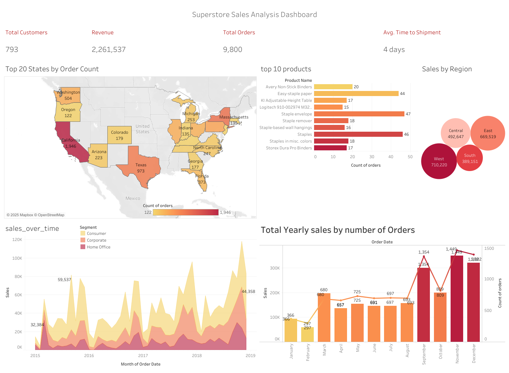

# Superstore Sales Analysis

This repository presents an analysis of the Superstore dataset, a simulated retail dataset reflecting sales operations across various regions in the United States. The dataset comprises approximately 10,000 records, capturing customer orders, shipment details, product information, and financial metrics such as sales and profit.

---

## Dataset Overview

- **Size**: ~10,000 records  
- **Period**: 2015 to 2019  
- **Scope**: Retail transactions, customer and product details, shipping data, and financial performance  
- **Tools Used**: Python (Pandas, PandaSQL) for data preprocessing and exploratory analysis  

The dataset was cleaned and explored using Pandas and PandaSQL to uncover preliminary insights and prepare it for effective visualization.

---

## Key Insights

- **California** recorded the highest total sales and revenue, with figures exceeding $700,000 in 2018.
- **November and December** contributed to over 50% of annual sales, indicating favorable conditions for launching new products, particularly in the Consumer segment.
- The **West Region** led all regions in total sales, followed by the East.
- The **average shipment time** was approximately 4 days, indicating efficient logistics and timely delivery.
- The most frequently ordered product was **Staple Envelopes**, followed by **Binders** and **Paper**.
- **Sales volume increased consistently** from 2015 to 2019, demonstrating positive business growth.

---

## Interactive Dashboard

Explore the interactive dashboard here:  
👉 [View Dashboard](https://public.tableau.com/app/profile/syed.jafri2681/viz/sales_dashboard_2_17456213076350/Dashboard1?publish=yes)

This dashboard provides a dynamic interface to explore sales performance by region, category, time, and shipping status.

---

